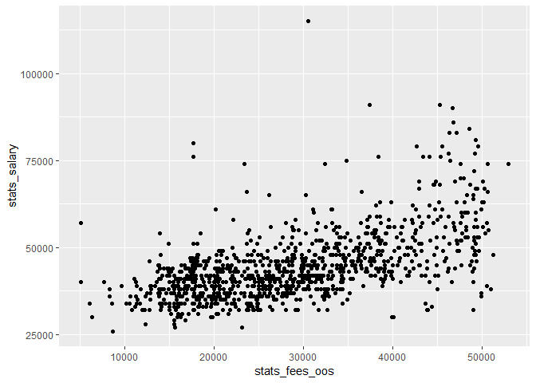
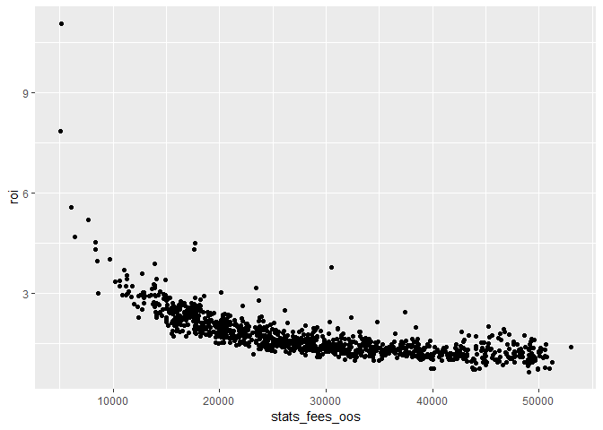

Times Higher Education College Ranking 2018
================

Load library
============

``` r
pacman::p_load(rvest, jsonlite, RCurl, data.table, ggplot2)
```

Get data
========

Use rvest to read the jquery script
-----------------------------------

``` r
webpage <- read_html(paste0(
  'https://www.timeshighereducation.com/rankings/united-states/', 
  '2018#!/page/0/length/25/sort_by/rank/sort_order/asc/cols/stats'))

t <- html_nodes(webpage, 'script') %>% 
  '['(9) %>% 
  html_text()
```

Use jsonlite to read the json object after inspecting the script
----------------------------------------------------------------

Found the json data at the following address

``` r
college_json <- fromJSON(paste0(
  'https://www.timeshighereducation.com/sites/default/files/the_data_rankings/', 
  'united_states_rankings_2018_limit0_efdb24148bae97278bbfe6ecfd71cdd9.json'))

college_dat <- college_json$data

#saveRDS(college_dat, './data/times_higher_education_2018_ranking.Rds')
```

Visualize the data
==================

``` r
setDT(college_dat)

dat <- copy(college_dat)

cols <- c('stats_fees_oos', 'stats_board', 'stats_salary')
dat[, (cols) := lapply(.SD, function(x) as.numeric(gsub('\\D', '', x))), .SDcols = cols]

dat <- dat[, .(rank_order, rank, name, scores_overall, scores_overall_rank,
               record_type, location, stats_fees_oos, stats_board, stats_salary)]

dat[, roi := stats_salary / stats_fees_oos]
dat[, rank_order := as.numeric(rank_order)]

ggplot(dat) +
  geom_point(aes(stats_fees_oos, stats_salary))
```



``` r
ggplot(dat) + 
  geom_point(aes(stats_fees_oos, roi))
```



Ranking schools by Return-on-investment
=======================================

If we use salary after 10 years over school tuition as a proxy for return on investment, what is the highest ROI for schools whose rankings are among the top 100?

``` r
knitr::kable(dat[rank_order <= 100][order(-roi)])
```

|  rank\_order| rank | name                                        | scores\_overall | scores\_overall\_rank | record\_type | location             |  stats\_fees\_oos|  stats\_board|  stats\_salary|        roi|
|------------:|:-----|:--------------------------------------------|:----------------|:----------------------|:-------------|:---------------------|-----------------:|-------------:|--------------:|----------:|
|           53| 53   | Georgia Institute of Technology             | 74.2            | 53                    | public       | Georgia              |             32396|         10716|          74000|  2.2842326|
|            1| 1    | Harvard University                          | 91.9            | 1                     | private      | Massachusetts        |             45278|         15381|          91000|  2.0098061|
|            3| =3   | Massachusetts Institute of Technology       | 90.4            | 3                     | private      | Massachusetts        |             46704|         13730|          90000|  1.9270298|
|           82| 82   | University of Maryland, College Park        | 70.3            | 82                    | public       | Maryland             |             31144|         11521|          60000|  1.9265348|
|           94| =93  | Texas A&M University                        | 69.1            | 94                    | public       | Texas                |             27745|         10338|          53000|  1.9102541|
|           43| 43   | Purdue University                           | 77.1            | 43                    | public       | Indiana              |             28804|         10030|          53000|  1.8400222|
|            4| =3   | Stanford University                         | 90.4            | 4                     | private      | California           |             46320|         14107|          83000|  1.7918826|
|           58| 58   | University of Florida                       | 73.6            | 58                    | public       | Florida              |             28659|          9650|          51000|  1.7795457|
|            9| 9    | Princeton University                        | 89.5            | 9                     | private      | New Jersey           |             43450|         14160|          76000|  1.7491369|
|           83| 83   | Worcester Polytechnic Institute             | 70.2            | 83                    | private      | Massachusetts        |             45590|         13410|          79000|  1.7328361|
|           31| 31   | Georgetown University                       | 80.8            | 31                    | private      | District of Columbia |             48611|         14574|          84000|  1.7280039|
|           98| 98   | Bentley University                          | 68.3            | 98                    | private      | Massachusetts        |             44085|         14520|          76000|  1.7239424|
|           72| =71  | University of Wisconsin-Madison             | 71.8            | 72                    | public       | Wisconsin            |             29665|          8804|          51000|  1.7191977|
|           48| 48   | University of Illinois at Urbana-Champaign  | 75.8            | 48                    | public       | Illinois             |             33222|         11010|          57000|  1.7157305|
|            7| 7    | California Institute of Technology          | 89.8            | 7                     | private      | California           |             45390|         13371|          76000|  1.6743776|
|           50| 50   | Lehigh University                           | 75.4            | 50                    | private      | Pennsylvania         |             46230|         12280|          77000|  1.6655851|
|           76| =75  | University of Pittsburgh                    | 71              | 76                    | public       | Pennsylvania         |             28958|         10900|          48000|  1.6575730|
|           88| =87  | Rensselaer Polytechnic Institute            | 69.9            | 88                    | private      | New York             |             49341|         14095|          81000|  1.6416368|
|           41| =40  | University of California, Berkeley          | 78.2            | 41                    | public       | California           |             38139|         15847|          62000|  1.6256326|
|           73| 73   | Washington and Lee University               | 71.4            | 73                    | private      | Virginia             |             46417|         10985|          75000|  1.6157873|
|            8| 8    | University of Pennsylvania                  | 89.6            | 8                     | private      | Pennsylvania         |             49536|         13990|          79000|  1.5947997|
|           25| 25   | University of California, Los Angeles       | 82.2            | 25                    | public       | California           |             37471|         14832|          59000|  1.5745510|
|           69| 69   | Ohio State University                       | 72.1            | 69                    | public       | Ohio                 |             27365|         11706|          43000|  1.5713503|
|            5| 5    | Duke University                             | 90.2            | 5                     | private      | North Carolina       |             49241|         14032|          77000|  1.5637375|
|           90| =89  | University of Washington                    | 69.6            | 90                    | public       | Washington           |             34143|         11310|          53000|  1.5522948|
|           47| 47   | University of California, San Diego         | 76.1            | 47                    | public       | California           |             38238|         12071|          59000|  1.5429677|
|           56| =56  | University of Texas at Austin               | 73.8            | 56                    | public       | Texas                |             34676|         11456|          53000|  1.5284347|
|           34| 34   | Case Western Reserve University             | 79.6            | 34                    | private      | Ohio                 |             44560|         13850|          68000|  1.5260323|
|           33| 33   | University of North Carolina at Chapel Hill | 80.2            | 33                    | public       | North Carolina       |             33673|         10902|          51000|  1.5145666|
|           46| 46   | University of California, Davis             | 76.8            | 46                    | public       | California           |             38659|         14571|          57000|  1.4744303|
|            6| 6    | Yale University                             | 90              | 6                     | private      | Connecticut          |             47600|         14600|          70000|  1.4705882|
|           70| 70   | Lafayette College                           | 72              | 70                    | private      | Pennsylvania         |             47010|         13920|          69000|  1.4677728|
|           14| 14   | Rice University                             | 87.4            | 14                    | private      | Texas                |             42253|         13650|          62000|  1.4673514|
|           10| 10   | Cornell University                          | 88.9            | 10                    | private      | New York             |             49116|         13678|          72000|  1.4659174|
|           20| 20   | Carnegie Mellon University                  | 86.1            | 20                    | private      | Pennsylvania         |             50665|         12830|          74000|  1.4605744|
|           24| 24   | University of Notre Dame                    | 83.1            | 24                    | private      | Indiana              |             47929|         13846|          70000|  1.4604936|
|           79| 79   | Trinity University                          | 70.6            | 79                    | private      | Texas                |             37856|         12362|          54000|  1.4264582|
|           85| =84  | Drexel University                           | 70              | 85                    | private      | Pennsylvania         |             44114|         14730|          62000|  1.4054495|
|            2| 2    | Columbia University                         | 90.6            | 2                     | private      | New York             |             53000|         12860|          74000|  1.3962264|
|           18| =17  | Johns Hopkins University                    | 86.8            | 18                    | private      | Maryland             |             48710|         14540|          68000|  1.3960172|
|           59| 59   | Bucknell University                         | 73.3            | 59                    | private      | Pennsylvania         |             50152|         12216|          69000|  1.3758175|
|           21| 21   | Vanderbilt University                       | 85.3            | 21                    | private      | Tennessee            |             44712|         14670|          61000|  1.3642870|
|          100| 100  | William & Mary                              | 68              | 100                   | public       | Virginia             |             41072|         10978|          56000|  1.3634593|
|           60| 60   | Boston College                              | 73.1            | 60                    | private      | Massachusetts        |             49324|         13496|          67000|  1.3583651|
|           80| 80   | Michigan State University                   | 70.5            | 80                    | public       | Michigan             |             36934|          9524|          50000|  1.3537662|
|           17| =17  | Dartmouth College                           | 86.8            | 17                    | private      | New Hampshire        |             49506|         14238|          67000|  1.3533713|
|           64| 64   | George Washington University                | 72.7            | 64                    | private      | District of Columbia |             48280|         12050|          65000|  1.3463132|
|           99| 99   | University of California, Santa Barbara     | 68.1            | 99                    | public       | California           |             38676|         14594|          52000|  1.3445031|
|           67| =66  | Northeastern University                     | 72.2            | 67                    | private      | Massachusetts        |             45530|         14470|          61000|  1.3397760|
|           57| =56  | University of Virginia                      | 73.8            | 57                    | public       | Virginia             |             44083|         10400|          59000|  1.3383844|
|           86| =84  | College of the Holy Cross                   | 70              | 86                    | private      | Massachusetts        |             47176|         12748|          63000|  1.3354248|
|           16| =15  | University of Southern California           | 87.3            | 16                    | private      | California           |             50277|         13855|          67000|  1.3326173|
|           35| 35   | Claremont McKenna College                   | 79.5            | 35                    | private      | California           |             49045|         15280|          65000|  1.3253135|
|           13| =11  | Washington University in St Louis           | 87.5            | 13                    | private      | NA                   |             48093|         15280|          63000|  1.3099619|
|           15| =15  | Northwestern University                     | 87.3            | 15                    | private      | Illinois             |             49047|         14936|          64000|  1.3048708|
|           32| 32   | Tufts University                            | 80.6            | 32                    | private      | Massachusetts        |             50604|         13094|          66000|  1.3042447|
|           27| 27   | University of Michigan                      | 81.8            | 27                    | public       | Michigan             |             45002|         10554|          58000|  1.2888316|
|           19| 19   | Emory University                            | 86.4            | 19                    | private      | Georgia              |             46314|         13130|          59000|  1.2739129|
|           92| 92   | Union College                               | 69.3            | 92                    | private      | New York             |             50013|         12261|          63000|  1.2596725|
|           52| 52   | Wake Forest University                      | 74.5            | 52                    | private      | North Carolina       |             47682|         12996|          60000|  1.2583365|
|           12| =11  | University of Chicago                       | 87.5            | 12                    | private      | Illinois             |             50193|         14772|          63000|  1.2551551|
|           62| =61  | University of Richmond                      | 73              | 62                    | private      | Virginia             |             48090|         11120|          60000|  1.2476606|
|           40| =40  | Boston University                           | 78.2            | 40                    | private      | Massachusetts        |             48436|         14520|          60000|  1.2387480|
|           29| 29   | New York University                         | 81              | 29                    | private      | New York             |             47750|         17580|          59000|  1.2356021|
|           55| 55   | Colgate University                          | 73.9            | 55                    | private      | New York             |             49970|         12570|          61000|  1.2207324|
|           28| 28   | Wellesley College                           | 81.1            | 28                    | private      | Massachusetts        |             46836|         14504|          57000|  1.2170126|
|           11| =11  | Brown University                            | 87.5            | 11                    | private      | Rhode Island         |             49346|         12700|          60000|  1.2159040|
|           74| 74   | Barnard College                             | 71.3            | 74                    | private      | New York             |             47631|         15110|          57000|  1.1966996|
|           96| =96  | University of Denver                        | 68.6            | 96                    | private      | Colorado             |             44178|         11702|          52000|  1.1770565|
|           87| =87  | Brandeis University                         | 69.9            | 87                    | private      | Massachusetts        |             49298|         13856|          58000|  1.1765183|
|           54| 54   | Davidson College                            | 74              | 54                    | private      | North Carolina       |             46966|         13153|          55000|  1.1710599|
|           51| 51   | University of Rochester                     | 74.6            | 51                    | private      | New York             |             48260|         14294|          56000|  1.1603813|
|           44| 44   | University of Miami                         | 77              | 44                    | private      | Florida              |             45724|         12908|          53000|  1.1591287|
|           39| 39   | Bowdoin College                             | 78.4            | 39                    | private      | Maine                |             48212|         13142|          55000|  1.1407948|
|           42| 42   | Haverford College                           | 78              | 42                    | private      | Pennsylvania         |             49098|         14888|          56000|  1.1405760|
|           61| =61  | Hamilton College                            | 73              | 61                    | private      | New York             |             49500|         12570|          56000|  1.1313131|
|           36| 36   | Middlebury College                          | 79              | 36                    | private      | Vermont              |             47828|         13628|          54000|  1.1290457|
|           23| 23   | Amherst College                             | 84.4            | 23                    | private      | Massachusetts        |             50562|         13210|          57000|  1.1273288|
|           22| 22   | Williams College                            | 85              | 22                    | private      | Massachusetts        |             50070|         13220|          56000|  1.1184342|
|           49| 49   | Bryn Mawr College                           | 75.5            | 49                    | private      | Pennsylvania         |             47140|         14850|          52000|  1.1030972|
|           81| 81   | Southern Methodist University               | 70.4            | 81                    | private      | Texas                |             48190|         15575|          53000|  1.0998132|
|           66| =66  | Bates College                               | 72.2            | 66                    | private      | Maine                |             48435|         14105|          53000|  1.0942500|
|           26| 26   | Pomona College                              | 82.1            | 26                    | private      | California           |             47620|         15150|          52000|  1.0919782|
|           95| =93  | Trinity College                             | 69.1            | 95                    | private      | Connecticut          |             50776|         13144|          55000|  1.0831889|
|           65| 65   | Colby College                               | 72.4            | 65                    | private      | Maine                |             49120|         12610|          53000|  1.0789902|
|           89| =89  | Franklin and Marshall College               | 69.6            | 89                    | private      | Pennsylvania         |             50400|         12770|          54000|  1.0714286|
|           71| =71  | Tulane University                           | 71.8            | 71                    | private      | Louisiana            |             49638|         13186|          53000|  1.0677304|
|           84| =84  | Denison University                          | 70              | 84                    | private      | Ohio                 |             47290|         11570|          49000|  1.0361599|
|           30| 30   | Swarthmore College                          | 80.9            | 30                    | private      | Pennsylvania         |             47442|         13958|          49000|  1.0328401|
|           45| 45   | Wesleyan University                         | 76.9            | 45                    | private      | Connecticut          |             48974|         13504|          50000|  1.0209499|
|           77| 77   | Mount Holyoke College                       | 70.9            | 77                    | private      | Massachusetts        |             43886|         12860|          44000|  1.0025976|
|           91| 91   | Occidental College                          | 69.5            | 91                    | private      | California           |             49248|         13946|          49000|  0.9949643|
|           93| =93  | Scripps College                             | 69.1            | 93                    | private      | California           |             49152|         15108|          48000|  0.9765625|
|           38| 38   | Carleton College                            | 78.6            | 38                    | private      | Minnesota            |             49263|         12783|          48000|  0.9743621|
|           37| 37   | Smith College                               | 78.9            | 37                    | private      | Massachusetts        |             46288|         15470|          44000|  0.9505703|
|           78| 78   | Macalester College                          | 70.8            | 78                    | private      | Minnesota            |             48887|         10874|          46000|  0.9409454|
|           68| =66  | Vassar College                              | 72.2            | 68                    | private      | New York             |             51250|         11980|          48000|  0.9365854|
|           75| =75  | Grinnell College                            | 71              | 75                    | private      | Iowa                 |             46990|         11408|          44000|  0.9363694|
|           97| =96  | Kenyon College                              | 68.6            | 97                    | private      | Ohio                 |             49140|         11960|          44000|  0.8954009|
|           63| 63   | Oberlin College                             | 72.9            | 63                    | private      | Ohio                 |             50586|         13630|          39000|  0.7709643|
